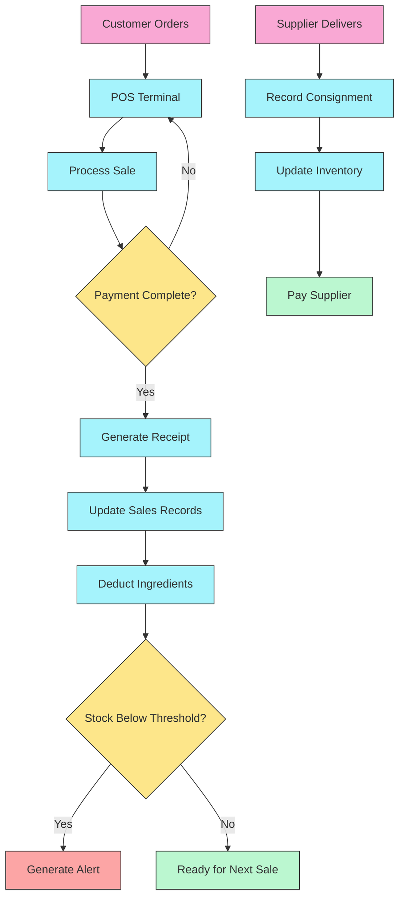

<div align="center">
  
  <p><em>Advanced Point-of-Sale and Inventory Management System for Tom N Toms Coffee in Davao City</em></p>
</div>

# TrackNToms

## 🎯 Overview
TrackNToms is a comprehensive point-of-sale and inventory management system tailor-made for Tom N Toms Coffee located in Davao City, Philippines. The system seamlessly integrates sales processing with inventory tracking, creating an efficient workflow that automatically updates stock levels when products are sold. Designed with both staff and management in mind, TrackNToms offers an intuitive interface combined with powerful backend capabilities.

## ⚡ Key Features
- **Intelligent POS Terminal**: Process orders and track sales in real-time
- **Ingredient-based Inventory**: Automatic stock deduction based on recipes
- **Supplier Management**: Track consignments, deliveries, and returns
- **Staff Controls**: Role-based access and performance monitoring
- **Financial Reporting**: Comprehensive analytics and sales metrics
- **Customizable Menu**: Easily update products and pricing
- **Multi-payment Integration**: Support for cash, cards, and mobile payments

## 🔧 Technical Implementation
Built with modern web technologies:

- React frontend with Tailwind CSS for responsive design
- Node.js and Express for robust API functionality
- MySQL database for reliable data persistence
- JWT authentication for secure access control
- Real-time inventory updates and alerts

## 🎨 System Modules
- Dashboard (Key metrics and alerts)
- POS Terminal (Sales processing)
- Inventory (Stock management)
- Suppliers (Vendor coordination)
- Staff (Employee management)
- Reports (Business analytics)
- Settings (System configuration)

## 🚀 Getting Started

### Prerequisites
- Node.js (v16 or higher)
- MySQL Server
- npm or yarn package manager
- Vite for development server

### Installation Steps
1. Clone the repository:
   ```bash
   git clone https://github.com/Auguzcht/TrackNToms-POS.git
   cd TrackNToms-POS
   ```

2. Install dependencies:
   ```bash
   npm install
   ```

3. Configure environment variables:
   ```bash
   # Copy .env.example to .env
   cp .env.example .env
   # Update database credentials and other settings
   ```

4. Start the development server:
   ```bash
   npm run dev
   ```

5. Access the application:
   - Web Connection: http://localhost:5173

## 🔄 System Workflow



## 📊 Usage Examples

### POS Terminal
```javascript
// Add items to order
orderContext.addItem({
  item_id: 1,
  item_name: "Espresso",
  price: 3.50,
  quantity: 1
});

// Process payment
await orderContext.processPayment({
  method: "cash",
  amount: 5.00,
  change: 1.50
});
```

### Inventory Management
```javascript
// Check ingredient availability
const availability = await inventory.checkAvailability(itemId, quantity);
if (availability.available) {
  // Proceed with order
} else {
  // Show out of stock message
}

// Update stock levels after delivery
await inventory.updateStock(ingredientId, deliveredQuantity);
```

## 🛠️ Development

## 💭 Scripts
- `npm run dev` - Start development server
- `npm run build` - Build for production
- `npm run preview` - Preview production build

### Testing
```bash
# Run all tests
npm run test

# Run specific test suite
npm run test:inventory
```

## 📱 Local Customizations
- **Philippine Peso Support**: Currency formatting and tax calculations
- **Davao City Suppliers**: Pre-configured with local vendor information
- **Filipino Language Support**: Interface translations for staff comfort
- **Regional Tax Compliance**: BIR-compliant tax reporting
- **Local Payment Methods**: GCash, Maya, and other Philippine options

## 🤝 Contributing
1. Fork the repository
2. Create your feature branch (`git checkout -b feature/AmazingFeature`)
3. Commit your changes (`git commit -m 'Add some AmazingFeature'`)
4. Push to the branch (`git push origin feature/AmazingFeature`)
5. Open a Pull Request

## 📈 Implementation Status

| Module | Status | Completion |
|--------|--------|------------|
| POS Terminal | ✅ Complete | 100% |
| Inventory Management | ✅ Complete | 100% |
| Supplier Management | ✅ Complete | 100% |
| Staff Management | ✅ Complete | 100% |
| Reporting | ✅ Complete | 100% |
| Mobile Optimization | 🟡 In Progress | 20% |

## 👥 Team
- **Joshua Famor** - Project Lead
- **Alfred Nodado** - Full-Stack Developer and Systems Administrator
- **Hanna Sato** - UI/UX Designer

## 🙏 Acknowledgments
- Tom N Toms Coffee Davao Management for business requirements
- Mapúa Malayan Colleges Mindanao and CCIS Department
- React and Node.js development communities
- All contributors and testers who provided feedback

## 📋 Tech Stack
- **Frontend**: React 18, Tailwind CSS, Framer Motion, React Router 6, Chart.js
- **Backend**: Node.js, Express, JWT, Multer, Sharp
- **Database**: MySQL, MariaDB compatible
- **Development**: Vite, ESLint, Git

<div align="center">
  <p>Developed for course terminal requirements under CS107, CS152, IT104, CS158</p>
  <p>Mapúa Malayan Colleges Mindanao, Davao City</p>
  <p>© 2025 TrackNToms</p>
</div>